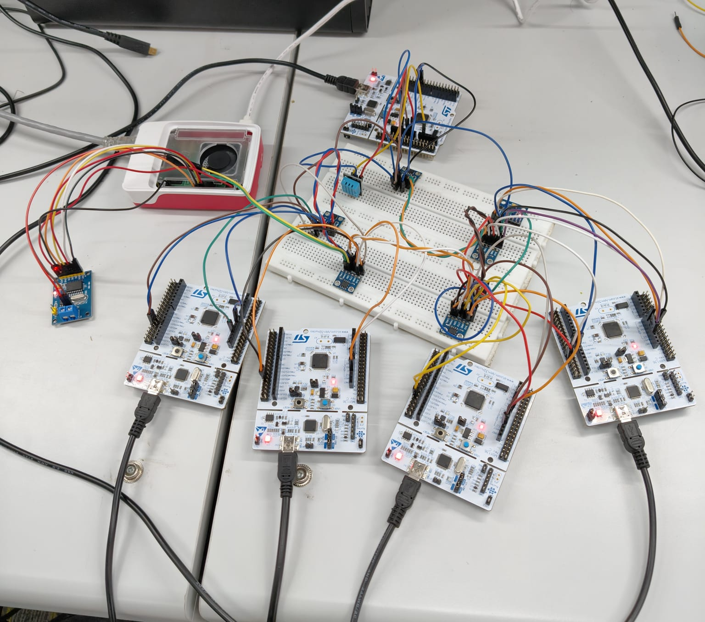
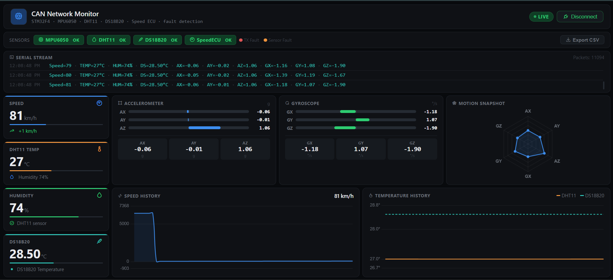
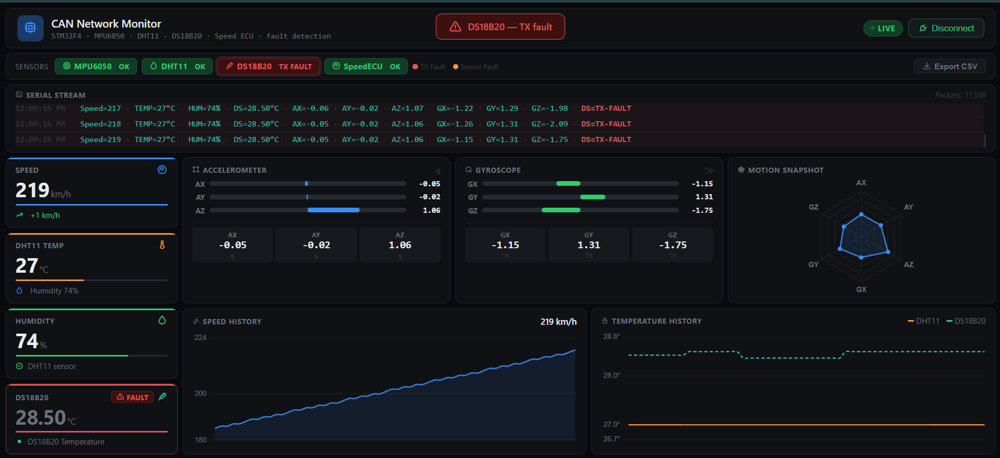
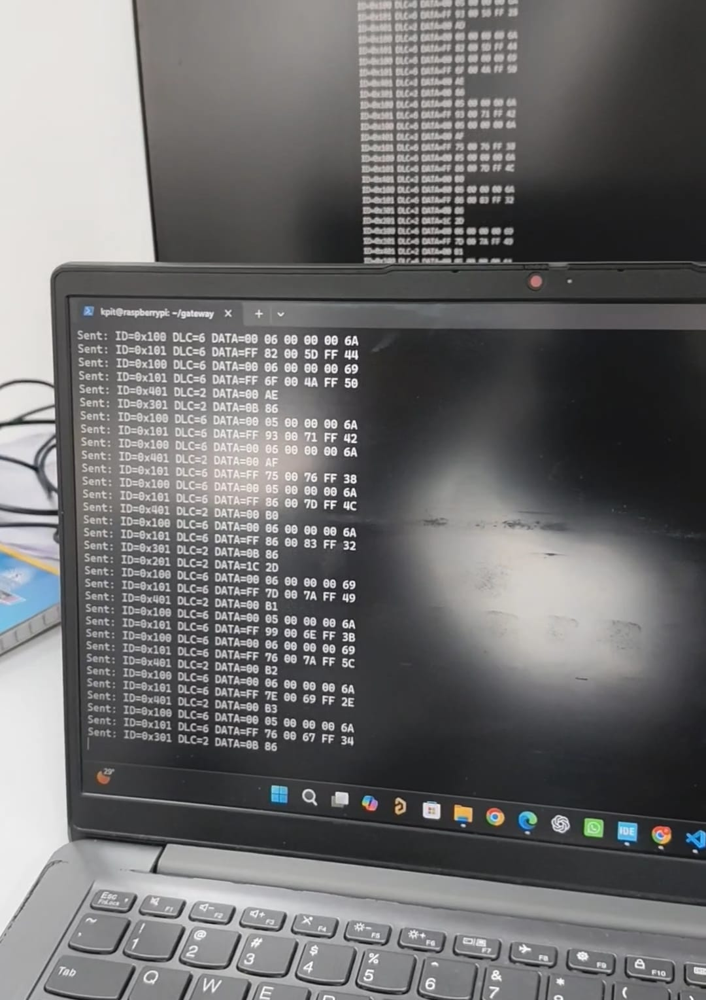

# 🚗 CAN Sensor Telemetry Network
A real-time automotive communication system that simulates multiple (ECUs) communicating over a Controller Area Network (CAN) Bus. The project collects sensor data from different ECUs, transmits it to a central receiver, detects abnormal CAN traffic, and forwards the received data over Ethernet using UDP for remote monitoring.

---

# 📖 Overview

This project implements a distributed **Automotive Sensor Telemetry Network** that simulates how multiple Electronic Control Units (ECUs) communicate in modern vehicles.

Five STM32F446RE-based ECUs acquire real-time sensor data and exchange telemetry over the **Controller Area Network (CAN)**. A dedicated Receiver ECU collects and validates the incoming CAN messages before forwarding them to a **Raspberry Pi 5**.

Using an **MCP2515 CAN Controller**, the Raspberry Pi acts as a **CAN-to-Ethernet Gateway**, converting CAN telemetry into UDP packets and transmitting them over Ethernet to a remote PC.

The received telemetry is visualized through a real-time web dashboard, providing live sensor monitoring, system health, fault indication, and data visualization.

---

# 🎯 Problem Statement

Design and implement a distributed sensor telemetry subsystem capable of acquiring physical sensor data from multiple embedded nodes and periodically publishing the telemetry to an external monitoring system using a fixed and reliable communication format.

The system should operate continuously, tolerate sensor failures without interrupting communication, and emulate the architecture used in modern automotive embedded systems.

---

# 🚀 Project Objectives

- Develop multiple STM32-based Sensor ECUs
- Acquire real-time sensor data
- Transmit periodic telemetry over CAN Bus
- Implement a dedicated Receiver ECU
- Build a CAN-to-Ethernet Gateway using Raspberry Pi 5
- Transfer telemetry using UDP over Ethernet
- Design a real-time monitoring dashboard
- Implement sensor fault detection and reporting
- Demonstrate continuous system operation without interruption

---

# 🏗 System Architecture

```

MPU6050 ECU
│
├──────────────┐
│
DHT11 ECU
│
├──────────────┤
│
DS18B20 ECU
│
├──────────────┤
│
Speed ECU
│
└──────────────┘

↓

CAN BUS

↓

Receiver ECU
(STM32F446RE)

↓

SPI

↓

MCP2515 CAN Controller

↓

Raspberry Pi 5
(CAN-to-Ethernet Gateway)

↓

UDP over Ethernet

↓

Remote PC

↓

Python Receiver

↓

Web Dashboard

```

---

# ⚙ Hardware Components

| Component | Purpose |
|------------|----------|
| STM32F446RE (5 Boards) | Sensor ECUs + Receiver ECU |
| MPU6050 | Accelerometer & Gyroscope |
| DHT11 | Temperature & Humidity |
| DS18B20 | Digital Temperature Sensor |
| MCP2515 | CAN Controller |
| Raspberry Pi 5 | CAN-to-Ethernet Gateway |
| SN65HVD230 | CAN Transceiver |
| Ethernet Network | Data Transmission |
| PC | Dashboard & Monitoring |

---

# 📡 ECU Configuration

| ECU | Function |
|------|----------|
| ECU-1 | MPU6050 Sensor Node |
| ECU-2 | DHT11 Sensor Node |
| ECU-3 | DS18B20 Sensor Node |
| ECU-4 | Speed Data Node |
| ECU-5 | Receiver ECU |

---

# 📊 Sensor Telemetry

The system periodically transmits:

- Accelerometer X
- Accelerometer Y
- Accelerometer Z
- Gyroscope X
- Gyroscope Y
- Gyroscope Z
- Temperature
- Humidity
- DS18B20 Temperature
- Vehicle Speed
- Sensor Status
- Fault Status

---

# 📑 CAN Frame Mapping

| CAN ID | ECU | Payload |
|---------|------|-----------------------------|
| 0x100 | MPU6050 | AX AY AZ |
| 0x101 | MPU6050 | GX GY GZ |
| 0x201 | DHT11 | Temperature Humidity |
| 0x301 | DS18B20 | Temperature |
| 0x401 | Speed ECU | Vehicle Speed |


# 📦 Telemetry Features

✔ Fixed Transmission Format

✔ Periodic Data Publishing

✔ Consistent Data Scaling

✔ Continuous Transmission

✔ Automatic Startup

✔ Multi-node Communication

✔ Real-time Monitoring

---

# ⚠ Fault Behaviour

The system implements fault-tolerant telemetry.

If any sensor fails,

- Telemetry continues uninterrupted.
- Remaining sensor values are transmitted normally.
- A fault flag is added to the telemetry frame.
- The dashboard immediately indicates the failed sensor.

Example:

```

DS18B20
Status : SENSOR FAULT

```

The system never hangs or stops transmitting due to a sensor failure.

---

# 🌐 CAN-to-Ethernet Gateway

The Raspberry Pi 5 functions as the communication gateway.

Responsibilities include:

- Reading CAN frames through MCP2515
- Decoding telemetry
- Creating UDP packets
- Transmitting telemetry over Ethernet
- Maintaining continuous communication with the monitoring PC

---

# 📈 Dashboard Features

The dashboard provides:

- Live CAN Stream
- Sensor Status
- Vehicle Speed
- Accelerometer Visualization
- Gyroscope Visualization
- Motion Radar Graph
- Speed History
- Temperature History
- Humidity Display
- Sensor Fault Alerts
- Connection Status
- CSV Export

---

## Dashboard

- Live CAN Stream
- Speed Graph
- Temperature Graph
- Motion Snapshot
- Sensor Health
- Fault Alerts

---

# 🧪 Testing

The project was validated for:

- Multi-node CAN Communication
- Sensor Acquisition
- Continuous Telemetry
- Receiver Validation
- Gateway Communication
- UDP Transmission
- Dashboard Visualization
- Fault Behaviour
- Continuous Runtime

---
---

# 📷 Project Demonstration

The following images showcase the successful implementation and validation of the **CAN Sensor Telemetry Network** on actual hardware. The system was tested using five STM32F446RE ECUs, a Raspberry Pi 5 acting as a CAN-to-Ethernet gateway, and a real-time monitoring dashboard.

---

## 🔧 Hardware Setup

The prototype consists of five STM32F446RE Nucleo boards connected through the CAN Bus. Each board acts as a dedicated ECU responsible for sensor acquisition or telemetry processing.

**ECU Configuration:**
- **ECU-1:** MPU6050 (Accelerometer & Gyroscope)
- **ECU-2:** DHT11 (Temperature & Humidity)
- **ECU-3:** DS18B20 Temperature Sensor
- **ECU-4:** Speed ECU (Raw Speed Data)
- **ECU-5:** Receiver ECU

The Receiver ECU validates incoming CAN frames and forwards the telemetry to the Raspberry Pi 5 through the MCP2515 CAN controller.

<p align="center">
    
</p>

---

## 📊 Real-Time Dashboard

A custom web dashboard was developed to visualize telemetry received from all ECUs in real time.

**Dashboard Features:**
- Live CAN Stream
- Vehicle Speed
- MPU6050 Accelerometer & Gyroscope
- Temperature & Humidity
- DS18B20 Temperature
- Motion Snapshot
- Historical Graphs
- Sensor Health Monitoring

The image below shows the system operating normally with all ECUs transmitting valid telemetry.

<p align="center">
    
</p>

---

## ⚠ Sensor Fault Detection

To improve system reliability, the Receiver ECU continuously monitors sensor health. If a sensor fails or produces invalid data, a fault flag is embedded into the telemetry while the remaining ECUs continue transmitting without interruption.

The image below demonstrates a **DS18B20 Sensor Fault**, where the dashboard clearly identifies the failed sensor while maintaining continuous telemetry from the other ECUs.

<p align="center">
    
</p>

---

## 🚨 CAN Transmission Fault Detection

The Receiver ECU also detects communication failures from individual ECUs. If an ECU stops transmitting valid CAN frames, the system generates a transmission fault while continuing normal operation for the remaining nodes.

The dashboard below shows a **DS18B20 Transmission (TX) Fault** detected during runtime.

<p align="center">
    
</p>

---

## 🌐 CAN-to-Ethernet Gateway

The Raspberry Pi 5 functions as a **CAN-to-Ethernet Gateway**. It receives CAN frames through the MCP2515 CAN controller, encapsulates the telemetry into UDP packets, and transmits them over Ethernet to the monitoring PC.

<p align="center">
    
</p>

---

## 🧪 Complete System Validation

The complete prototype was successfully validated on actual hardware.

**Successfully Demonstrated:**

- ✅ Multi-ECU CAN Communication
- ✅ Real-Time Sensor Telemetry
- ✅ Receiver ECU Implementation
- ✅ Raspberry Pi 5 CAN-to-Ethernet Gateway
- ✅ UDP Communication over Ethernet
- ✅ Live Web Dashboard
- ✅ Sensor Fault Detection
- ✅ CAN Transmission Fault Detection
- ✅ Continuous System Operation

The image below shows the complete end-to-end implementation during live testing.

<p align="center">
    
</p>

---

# 🎯 Conclusion

This project successfully demonstrates a distributed automotive sensor telemetry network using five STM32F446RE-based ECUs communicating over the CAN Bus. A Raspberry Pi 5 equipped with an MCP2515 CAN controller serves as a CAN-to-Ethernet gateway, forwarding telemetry to a remote PC over UDP for real-time monitoring. The implementation validates reliable multi-node communication, fault-tolerant telemetry transmission, and live visualization through a custom dashboard, closely resembling the architecture of modern automotive embedded systems.
